# Idempotency in API Design: How to Make Retries Safe

> Retries are normal in real APIs because networks timeout, clients reconnect, and users submit the same action again. Idempotency keeps those retries safe so one user intent does not create duplicate side effects in your data.

## The Core Problem

A user submits a payment request, but the response times out before it reaches the client.

The user clicks Pay again, or the app retries automatically.

Without idempotency, the server may process the same payment intent twice.

That creates real business issues:

- **Duplicate side effects** — such as double charges, duplicate orders, or repeated short-link creation.
- **Confusing user experience** — when one action appears to happen twice.
- **Support overhead** — extra support and reconciliation work for the team.

## Why Idempotency Is the Solution

Idempotency means repeated requests with the same intent should produce one logical outcome.

In plain language:

- Same intent in -> same final result out.
- Retries become safe instead of risky.
- Correctness comes first, performance comes second.

> This is why idempotency is a reliability requirement for any retry-prone API, not an optional feature.

## Core Pattern You Can Reuse

1. Normalize input first so equivalent payloads map to the same intent.
2. Build a deterministic intent key from the normalized fields.
3. Check existing intent before attempting a new write.
4. Enforce a DB uniqueness constraint as the final guardrail under concurrency.
5. Return deterministic responses (`201` for new, `200` for duplicate intent).

## Request Sequence Diagram

```mermaid
sequenceDiagram
  autonumber
  participant C as Client
  participant API as API
  participant DB as Postgres

  rect rgb(18, 58, 39)
    C->>API: POST /v1/links (intent X)
    API->>DB: INSERT intent X
    DB-->>API: success
    API-->>C: 201 Created
  end

  rect rgb(30, 58, 89)
    C->>API: Retry same POST (intent X)
    API->>DB: FIND by intent X
    DB-->>API: existing row
    API-->>C: 200 OK (same resource)
  end
```

## Redirect/Create Flow Step by Step

The following examples show idempotency in a URL shortener create endpoint (`POST /v1/links`).

The goal is simple: if the same `long_url` is submitted multiple times with the same intent, the system should return one logical result instead of creating multiple short codes.

You can find full implementation references in the Trimly links below.

### 1) Build a deterministic intent key

Use normalized values so the same logical request always maps to one key.

<CodeToggle
  title="Show Go snippet - Deterministic intent key"
  language="go"
  code={`
// Same normalized input must always produce the same key.
func BuildIntentKey(longURL string, expiresAt *time.Time) string {
    // Builder avoids repeated string allocations for hot paths.
    var b strings.Builder
    // Length prefix avoids ambiguous concatenation collisions.
    b.WriteString(strconv.Itoa(len(longURL)))
    b.WriteString(":")
    // longURL must already be normalized before this function.
    b.WriteString(longURL)
    // Separator between URL and expiry segment.
    b.WriteString("|")

    if expiresAt == nil {
        // Explicit no-expiry marker keeps key deterministic.
        b.WriteString("no-expiry")
        return b.String()
    }

    // Use UTC format so timezone differences do not change intent key.
    b.WriteString(expiresAt.UTC().Format(time.RFC3339Nano))
    return b.String()
}
  `}
/>

### 2) Check existing intent before writing

Fast pre-check handles common retry cases and returns the existing resource.

<CodeToggle
  title="Show Go snippet - Service duplicate handling"
  language="go"
  code={`
// First read path: check if this logical request already exists.
existing, ok, err := s.store.FindByIntent(ctx, normalizedURL, normalizedExpiry)
if err != nil {
    // Stop early on storage errors; caller decides HTTP mapping.
    return store.Link{}, false, err
}
if ok {
    // Same logical create request seen before.
    // Returning existing prevents duplicate inserts.
    return existing, false, nil
}
  `}
/>

### 3) Handle write races with DB uniqueness

Under concurrency, two requests can pass the pre-check at nearly the same time.

The DB uniqueness constraint on the intent key is the final safety layer:

1. First insert succeeds.
2. Second insert fails with a unique violation (`23505`) on the intent key.
3. Service catches that failure and reads the existing row.
4. API returns the existing logical resource instead of creating a duplicate.

> This is what makes idempotency reliable even when requests arrive in parallel.

<CodeToggle
  title="Show Go snippet - Unique constraint mapping"
  language="go"
  code={`
// Convert low-level DB write errors into domain-level service errors.
func mapWriteError(err error) error {
    var pgErr *pgconn.PgError
    // 23505 is Postgres unique_violation.
    if errors.As(err, &pgErr) && pgErr.Code == "23505" {
        switch pgErr.ConstraintName {
        case "links_code_key":
            // Collision on generated short code.
            return store.ErrCodeExists
        case "links_intent_key_key":
            // Duplicate create intent detected under concurrency.
            return store.ErrIntentExists
        }
    }
    // Unknown DB error: bubble up as-is.
    return err
}
  `}
/>

### 4) Return deterministic HTTP status

> Keep API responses explicit: `201` for first successful create, `200` for duplicate intent.

<CodeToggle
  title="Show Go snippet - 201 for new, 200 for duplicate"
  language="go"
  code={`
// Service returns created=true only for first successful logical write.
link, created, err := h.svc.Create(c.Request.Context(), req.LongURL, req.ExpiresAt)
if err != nil {
    // handle error...
}

// Default to 200 for idempotent duplicate responses.
status := http.StatusOK
if created {
    // First write for this intent gets 201.
    status = http.StatusCreated
}
// Response payload remains the same logical resource in both paths.
c.JSON(status, resp)
  `}
/>

## Concurrency Guardrail Diagram

```mermaid
sequenceDiagram
  autonumber
  participant A as Request A
  participant B as Request B
  participant S as Service
  participant DB as Postgres

  rect rgb(18, 58, 39)
    A->>S: Create(intent X)
    S->>DB: INSERT intent X
    DB-->>S: success
    S-->>A: created=true
  end

  rect rgb(61, 49, 20)
    B->>S: Create(intent X)
    S->>DB: INSERT intent X
    DB-->>S: unique violation (23505)
    S->>DB: FIND by intent X
    DB-->>S: existing row
    S-->>B: created=false (same resource)
  end
```

## Reliability Outcomes

These are behavior guarantees, not performance claims:

| Scenario | Expected behavior | Why it matters |
| --- | --- | --- |
| Client timeout then retry | API returns same logical resource instead of creating a second one | Users do not get duplicate outcomes from one action |
| Two concurrent requests with same intent | One write succeeds, the other resolves to existing row | Data stays consistent under race conditions |
| Duplicate create call in tests | Handler returns `200` with same code after initial `201` | Contract is testable and predictable for integrations |
| Real traffic retries | Retry behavior is safe by design | Support overhead and reconciliation risk are reduced |

Implementation proof:

- `internal/httpapi/links_handlers_test.go` includes duplicate-intent behavior checks such as `TestCreateLink_IdempotentDuplicateReturns200`.

## Practical Tradeoffs

- **Implementation complexity** — Idempotency increases implementation complexity in service and storage layers.
- **Normalization stability** — Input normalization rules must be stable, documented, and tested.
- **Database as safety net** — DB constraints are required to complete safety under concurrency.
- **Response semantics alignment** — Teams must align on response semantics so clients can rely on them.

## How This Maps to Trimly

I use this exact reliability model in Trimly's create flow.

Trimly references:

- [Trimly repository](https://github.com/Thirana/Trimly)
- [Intent key implementation](https://github.com/Thirana/Trimly/blob/main/internal/store/intent.go)
- [Service create flow](https://github.com/Thirana/Trimly/blob/main/internal/shortener/service.go)
- [Postgres constraint mapping](https://github.com/Thirana/Trimly/blob/main/internal/store/postgres/store.go)
- [HTTP handler behavior](https://github.com/Thirana/Trimly/blob/main/internal/httpapi/links_handlers.go)

## Related Reading

If you want to see how read-path performance is handled in the same system, read [How Caching Works in a URL Shortener](/blog/url-shortener-caching).

If you want to see how static, SSG, and dynamic rendering are used in this portfolio platform, read [Rendering Techniques in Next.js](/blog/rendering-techniques-nextjs-portfolio).
