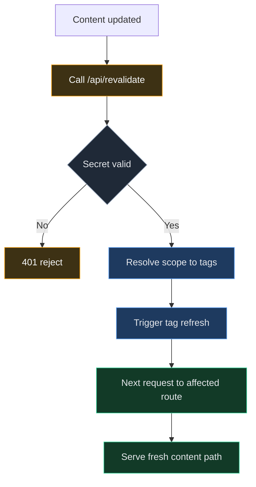

# Rendering Techniques in Next.js

> Rendering strategy is not only a performance choice. It is a product reliability choice that affects speed, freshness, and operational safety.

## What Rendering Means

In simple terms, rendering is the process of preparing the HTML that the browser finally shows to the user.

- The key decision is **when** that HTML is generated.
- That timing affects speed, freshness, and runtime cost.

### Build step responsibility

- During `npm run build`, Next.js pre-generates HTML for routes that are known and stable.
- In this project, that includes static routes and SSG slug routes discovered from MDX content.
- Build output is stored as static artifacts that can be served quickly.

### Server responsibility

- At request time, the server decides whether to return prebuilt HTML or run dynamic logic.
- For dynamic routes, it can generate HTML, JSON, or image responses.
- After revalidation, it can serve regenerated fresh content for affected routes.

### Browser responsibility

- The browser receives HTML and paints the initial UI.
- It then loads JavaScript and hydrates interactive client components.
- Even with the same UI, experience changes based on how quickly initial HTML arrives.

### How this connects in this project

- Most content pages use build-time generation.
- Runtime generation is limited to required routes (API and social images).
- On-demand revalidation is used for controlled freshness.
- That split is the practical rendering model shown below.

## Why Rendering Strategy Matters

If a content site renders everything dynamically, users may get slower response times and your platform spends more compute than necessary.

If a site renders everything only at build time, content freshness can suffer and operational workflows become rigid.

A professional setup picks the right mode per route:

1. Static where content is stable and fast delivery is critical.
2. SSG where slug pages can be precomputed from known content.
3. Dynamic only where runtime behavior is required.

## The Three Rendering Modes

### Static rendering

- **When generated:** Build time.
- **What browser receives:** Pre-rendered HTML.
- **Hydration:** Runs after first paint only for client components.
- **Best for:** Stable routes with high traffic and low change frequency.

Best for fixed routes like [`/`](/), [`/about`](/about), [`/blog`](/blog), and [`/projects`](/projects).

### SSG (Static Site Generation) for slug routes

- **When generated:** Build time, one page per known slug.
- **What browser receives:** Pre-rendered HTML for that slug.
- **Hydration:** Same model as static, only for client components.
- **Best for:** Content detail routes where slug list is known ahead of time.

In this project, `/blog/[slug]` and `/projects/[slug]` use `generateStaticParams` and `force-static`.

Live examples:

- Blog detail page: [`/blog/rendering-techniques-nextjs-portfolio`](/blog/rendering-techniques-nextjs-portfolio)
- Project detail page: [`/projects/personal-site`](/projects/personal-site)

### Dynamic server generation

- **When generated:** Request time.
- **What browser/client receives:** HTML for dynamic pages, or JSON/image for runtime endpoints.
- **Hydration:** Still applies only where client components exist.
- **Important clarification:** Dynamic rendering does not mean an empty page is sent first.
- **Best for:** Runtime workflows that depend on request-time logic.

In this project, route handlers and image routes such as `/api/revalidate` and slug-based social image routes are runtime generated.

Note: `/api/revalidate` is intentionally protected by a secret and is not a public browser route.

Live dynamic image examples:

- Blog OG image: [`/blog/rendering-techniques-nextjs-portfolio/opengraph-image`](/blog/rendering-techniques-nextjs-portfolio/opengraph-image)
- Project OG image: [`/projects/personal-site/opengraph-image`](/projects/personal-site/opengraph-image)

The route examples above are based on this project's real implementation, so you can open each path and compare behavior directly.

## How This Portfolio Uses Each Mode

This portfolio is static-first by design:

- **Static core pages** — prebuilt for low-latency delivery.
- **SSG for content detail** — blog and project detail pages use SSG with deterministic slug generation.
- **Minimal dynamic routes** — runtime generation is limited to workflows that must execute on demand.
- **Tag-based revalidation** — content freshness is controlled through tag-based revalidation, not full rebuilds for every update.

> The goal is not to pick one mode and apply it everywhere. The right setup assigns each route to the simplest mode that still satisfies its freshness and runtime needs.

## Rendering Decision Diagram

```mermaid
sequenceDiagram
  autonumber
  participant U as User
  participant R as Next Router
  participant B as Build Output
  participant S as Runtime Server

  U->>R: Request route

  rect rgb(18, 58, 39)
    R->>B: Static route (/, /blog, /projects, /about)
    B-->>U: Return prebuilt HTML
  end

  rect rgb(30, 58, 89)
    R->>B: Slug route with generateStaticParams
    B-->>U: Return pre-rendered slug page
  end

  rect rgb(61, 49, 20)
    R->>S: Runtime route (API/OG image)
    S-->>U: Generate response on demand
  end
```

## Route Mapping in This Project

| Route pattern | Rendering mode | Why this mode fits |
| --- | --- | --- |
| `/`, `/about`, `/blog`, `/projects` | Static | Fast delivery and predictable content shape |
| `/blog/[slug]` | SSG | Slugs are known at build time from MDX files |
| `/projects/[slug]` | SSG | Project slugs are known at build time from MDX files |
| `/api/revalidate` | Dynamic | Needs runtime auth, secret validation, and tag trigger |
| `/blog/[slug]/opengraph-image` | Dynamic | Social image is generated per slug at request/runtime |
| `/projects/[slug]/opengraph-image` | Dynamic | Social image is generated per project slug |

## Implementation Walkthrough

Quick map before code:

- Example 1 -> **SSG** (`/blog/[slug]`)
- Example 2 -> **SSG** (`/projects/[slug]`)
- Example 3 -> **Static-first content layer** (shared cache model used by static/SSG content routes)
- Example 4 -> **Dynamic** (`/api/revalidate`)

### 1) SSG example: blog detail route with static params

<CodeToggle
  title="Show TypeScript snippet - SSG blog route setup"
  language="typescript"
  code={`
export const dynamicParams = false;
export const dynamic = "force-static";

export async function generateStaticParams() {
    const posts = await getAllBlogPosts();
    // Pre-build all known blog slug pages.
    return posts.map((post) => ({ slug: post.slug }));
}
  `}
/>

### 2) SSG example: project detail route with static params

<CodeToggle
  title="Show TypeScript snippet - SSG project route setup"
  language="typescript"
  code={`
export const dynamicParams = false;
export const dynamic = "force-static";

export async function generateStaticParams() {
    const projects = await getAllProjects();
    // Pre-build all known project slug pages.
    return projects.map((project) => ({ slug: project.slug }));
}
  `}
/>

### 3) Static-first content layer: tagged cache boundaries for content routes

<CodeToggle
  title="Show TypeScript snippet - tagged content cache"
  language="typescript"
  code={`
export const CONTENT_CACHE_TAGS = {
    blog: "content:blog",
    projects: "content:projects",
} as const;

const getAllBlogPostsCached = unstable_cache(
    async () => readMdxMeta(blogDir),
    ["content-blog-list"],
    { tags: [CONTENT_CACHE_TAGS.blog] }
);

const getAllProjectsCached = unstable_cache(
    async () => readProjectMetaList(),
    ["content-project-list"],
    { tags: [CONTENT_CACHE_TAGS.projects] }
);
  `}
/>

### 4) Dynamic example: on-demand revalidation API

<CodeToggle
  title="Show TypeScript snippet - dynamic revalidation flow"
  language="typescript"
  code={`
function triggerRevalidation(scope: RevalidateScope) {
    const tags = scopeTags[scope];
    // Revalidate only target tag groups, not entire site cache.
    tags.forEach((tag) => revalidateTag(tag, "max"));
    return tags;
}

export async function POST(request: NextRequest) {
    // Secret validation happens before triggering tags.
    // scope can be "blog", "projects", or "all".
    const tags = triggerRevalidation(scope);
    return NextResponse.json({ ok: true, tags, mode: "max" });
}
  `}
/>

## Revalidation Lifecycle Diagram

- Revalidation is gated by secret validation.
- Scope controls which cache tags are refreshed.
- Fresh content is observed on subsequent requests.

> Revalidation is not a full rebuild. It is a targeted signal that tells the cache which routes need fresh content on the next request.

## Practical Tradeoffs

- **Static-first speed vs freshness**
   Prebuilt pages are very fast and cheap to serve, but content can become outdated if you do not pair static routes with a reliable update flow.
- **SSG scale vs slug discipline**
   SSG handles many content pages efficiently, but it depends on stable slug generation. If slugs are inconsistent, pages can be missing or incorrectly routed.
- **Dynamic flexibility vs runtime cost**
   Dynamic routes support request-time logic, but they increase server work and can add latency compared with static delivery.
- **Revalidation control vs operational safety**
   Tag-based revalidation gives targeted freshness, but secret validation and scope handling must be correct to avoid unauthorized calls or wrong cache invalidation.

In practice, the goal is not to use one mode everywhere. The best outcome comes from assigning each route to the simplest mode that still satisfies freshness and runtime needs.

## How This Connects to My Personal Site Project

This blog documents the actual rendering strategy used in my `Personal Site` project.

The same route flags, cache tags, and revalidation behavior described above are implemented in the production architecture of this portfolio.

## Related Reading

- [How Caching Works in a URL Shortener](/blog/url-shortener-caching)
- [Idempotency in API Design: How to Make Retries Safe](/blog/idempotency-in-api-design)
