# Session Security in Practice: JWTs, Token Rotation, and Reuse Detection

> This article covers the session security model used in the [Grow Logs project](/projects/grow-logs), a full-stack SaaS where users authenticate across sessions and devices. The same pattern applies to any API that issues refresh tokens.

## The Session Architecture

A complete session in this system has three separate pieces, each stored differently for a specific reason.

| Piece             | What it is                        | Where it lives                        |
| ----------------- | --------------------------------- | ------------------------------------- |
| Access token      | Short-lived JWT (1 hour)          | Memory and sessionStorage             |
| Refresh token     | Long-lived opaque string (7 days) | `HTTP-only` cookie on the API origin  |
| Session indicator | Non-secret flag cookie            | Regular cookie on the frontend origin |

The access token authenticates individual API requests. The refresh token extends the session without asking the user to log in again. The indicator cookie tells the frontend middleware a session exists without exposing any secret value.

## How Access Tokens Work

### Why JWT

HTTP is stateless. Every request arrives at the server with no memory of what came before; the server treats each one as if it is the first.

That works for fetching a public page. It breaks down the moment the application needs to know who is making the request — to return a user's own log entries, check whether their plan allows a feature, or decide whether they can reach an admin endpoint.

> Something needs to carry identity across requests, and the choice of how to carry it affects the performance and security of every protected route in the application.

Two approaches exist:

- **Server-side sessions** — store the user's data in a database, give the client an opaque session ID, and look it up on every request. Simple, but adds a database round trip to every single protected request.
- **Server-signed tokens** — embed session data directly in the token and sign it cryptographically. The client holds the token. On every request, the server verifies the signature and reads the data out of the token itself, with no database involved.

JWT (JSON Web Token) is the most widely used format for server-signed tokens. The server signs a payload containing the user's ID, role, and expiry time using a secret key. Any server that knows the secret can verify the token independently, without contacting a session store.

### Structure

A JWT is three `Base64url`-encoded segments joined by dots:

```
header.payload.signature
```

The **header** declares the signing algorithm. The **payload** holds the claims — the data embedded in the token. The **signature** is a cryptographic hash of the header and payload using the server's secret key.

> The signature is what makes the token trustworthy. Anyone can decode the payload (it is just `Base64url`), but no one can produce a valid signature without the server's secret. A token with a tampered payload will fail verification immediately.

### What Goes in the Payload

When a user logs in, the server signs a token with these claims:

<CodeToggle
  title="JWT access token signing"
  language="typescript"
  code={`
const accessToken = this.jwtService.sign(
  { sub: user.id, role: user.role },
  { expiresIn: "1h" },
);
  `}
/>

| Claim  | Value             | Purpose                                       |
| ------ | ----------------- | --------------------------------------------- |
| `sub`  | User UUID         | Scopes every database query to the right user |
| `role` | `USER` or `ADMIN` | Controls access to admin endpoints            |
| `exp`  | Unix timestamp    | Token is rejected after this point            |
| `iat`  | Unix timestamp    | When the token was issued                     |

### How the Backend Verifies It

Verification has two steps:

1. Check the signature using the server's secret key. A tampered payload produces a mismatched signature and is rejected immediately.
2. Check the `exp` claim. If the current time is past the expiry, the token is dead regardless of the signature.

No database. No session store. The token is self-contained.

### What the Claims Are Used For

Once verified, the claims drive two things on every protected request.

The `sub` claim becomes the `userId` for every database query:

<CodeToggle
  title="Ownership-scoped database query"
  language="typescript"
  code={`
// No matter what the client sends in the request body,
// userId always comes from the verified token — never from user input.
const entries = await prisma.entry.findMany({
  where: { userId: currentUser.sub },
});
  `}
/>

> This is how data isolation works. A user with a valid token can only ever reach their own records. The scoping happens at the service layer on every query — not just at the route level.

The `role` claim is checked by the roles guard on admin endpoints:

<CodeToggle
  title="Role-based admin route guard"
  language="typescript"
  code={`// A regular user with a valid token is still blocked here.
// Authentication (who are you?) and authorization (are you allowed?) are separate.
@Roles('ADMIN')
@Get('admin/users')
findAllUsers() { ... }`}
/>

### Why Access Tokens Are Short Lived

JWTs cannot be invalidated after they are issued. The server has no way to revoke one; it will keep working until the `exp` claim passes. If a token is stolen, the attacker has access for whatever remains of its lifetime — one hour limits that window to something manageable.

But one hour also means the user would need to log in every hour. That is where the refresh token comes in.

## The Core Problem

A user logs in. The server issues two things: a short-lived access token (1 hour) and a longer-lived refresh token (7 days). When the access token expires, the client uses the refresh token to get a new pair silently — no login prompt required.

This works in the normal case. But what happens when the refresh token is leaked?

Common leak scenarios:

- The device is compromised by malware
- A database is breached and tokens are exposed
- Traffic is intercepted on an insecure connection

If the server accepts that token indefinitely, the attacker has 7 days of access and no one knows. If the server rotates on every use but does not detect reuse, the attacker can race the legitimate user and the server cannot tell the difference.

> Rotation without detection is not enough. A rotated token that is never checked for reuse gives the attacker a full replacement token pair on first use, with nothing to stop them from continuing.

## Why Short Lived Access Tokens Alone Are Not Enough

Short-lived JWTs are a good start. A leaked access token expires in an hour. But the refresh token backing it has a much longer window.

If a refresh token is stolen and the server has no rotation or detection:

1. The attacker can refresh indefinitely for the full 7-day window.
2. The legitimate user has no way to know their session is compromised.
3. The server has no signal that anything is wrong.

The access token lifetime limits the blast radius of one kind of leak. The refresh token needs its own protection.

## The Rotation and Detection Model

The practical model has three rules:

1. Every refresh token use issues a new refresh token and invalidates the old one.
2. A rotated token that arrives again is a signal that something is wrong.
3. When reuse is detected, all refresh tokens for that user are deleted immediately.

Rule one makes every token single-use. Rule two creates the detection mechanism. Rule three is the response — a full session wipe across all devices.

## Normal Refresh Flow

```mermaid
sequenceDiagram
  autonumber
  participant C as Client
  participant API as API
  participant DB as Postgres

  rect rgb(18, 58, 39)
    C->>API: POST /auth/refresh (refresh token via HTTP-only cookie)
    API->>DB: Load active refresh tokens for user
    API->>API: Compare incoming token against stored hashes
    API->>DB: Delete matched token
  end

  rect rgb(30, 58, 89)
    API->>DB: Insert new refresh token hash with fresh 7-day expiry
    API->>API: Sign new JWT access token
    API-->>C: New access token in body + new refresh token in HTTP-only cookie
  end
```



## 1. Store Refresh Tokens as Hashes, Not Plain Strings

A refresh token should never be stored in plain text. If the database is breached, plain tokens give the attacker immediate access to every active session.

The safer approach is to store only the `bcrypt` hash of the token and return the raw value to the client exactly once, at the moment of issuance.

<CodeToggle
  title="Storing refresh token as bcrypt hash"
  language="typescript"
  code={`// Generate an opaque random string. This is never stored.
const rawToken = randomBytes(64).toString("hex");

// Store only the hash in the database.
const tokenHash = await bcrypt.hash(rawToken, 10);

await prisma.refreshToken.create({
  data: {
    userId,
    tokenHash,
    expiresAt: addDays(new Date(), 7),
  },
});

// The raw token goes to the client. This is the last time it exists in plain form.
return rawToken;`}
/>

An opaque random string is used instead of a JWT for one reason: a JWT is self-contained and cannot be invalidated without a blocklist. An opaque token tied to a database row is gone the moment the row is deleted.

## 2. Rotate on Every Use

When the client sends a refresh token, the server:

1. Loads the user's active tokens from the database.
2. Finds the one that matches by comparing `bcrypt` hashes.
3. Deletes that token.
4. Issues a new token pair with a fresh expiry.

<CodeToggle
  title="Rotating a refresh token on use"
  language="typescript"
  code={`async function rotateRefreshToken(incomingToken: string, userId: string) {
  const activeTokens = await prisma.refreshToken.findMany({
    where: { userId },
  });

  // Compare the incoming token against each stored hash.
  const matched = await findMatchingToken(incomingToken, activeTokens);

  if (!matched) {
    // No match found — either invalid or already rotated.
    // Treat this as a stolen token scenario.
    await prisma.refreshToken.deleteMany({ where: { userId } });
    throw new UnauthorizedException(
      "Session invalidated. Please log in again.",
    );
  }

  // Delete the matched token before issuing a new one.
  await prisma.refreshToken.delete({ where: { id: matched.id } });

  return issueNewTokenPair(userId);
}`}
/>

> The delete happens before the new token is issued. This is intentional — if the issue step fails, the user logs in again rather than ending up with two active tokens for the same session.

## 3. Find the Matching Token with bcrypt

Because tokens are stored as hashes, finding the matching one requires comparing the incoming raw token against each stored hash.

<CodeToggle
  title="Finding a stored token by bcrypt comparison"
  language="typescript"
  code={`async function findMatchingToken(
  incomingToken: string,
  storedTokens: RefreshToken[],
): Promise<RefreshToken | null> {
  for (const stored of storedTokens) {
    const isMatch = await bcrypt.compare(incomingToken, stored.tokenHash);
    if (isMatch) return stored;
  }
  return null;
}`}
/>

This is a linear scan over the user's active sessions. Most users have one or two active sessions, so the cost is low. If a user has many active devices, this can be optimized by adding a short hash prefix as a lookup index, but at typical scale the simple loop is correct and fast enough.

## 4. Detect Reuse and Wipe All Sessions

If a token arrives and no active match is found, there are two possibilities:

1. The token has already been rotated by the legitimate user.
2. An attacker used the token first, and now the legitimate user is trying to refresh.

> The server cannot tell the difference. The only safe response is to treat both cases as a breach and delete every active session for that user immediately.

<CodeToggle
  title="Wiping all sessions on reuse detection"
  language="typescript"
  code={`if (!matched) {
  // A rotated token was presented again.
  // This could be an attacker who used the token before the legitimate user could.
  // Wipe all sessions to force re-authentication on every device.
  await prisma.refreshToken.deleteMany({ where: { userId } });
  throw new UnauthorizedException("Session invalidated. Please log in again.");
}`}
/>

This is the nuclear option. A legitimate user who triggers this (for example, a buggy client that retries a refresh request) will have to log in again. That is an acceptable tradeoff — the alternative is leaving stolen sessions open.

## Token Theft and Reuse Detection Flow

```mermaid
sequenceDiagram
  autonumber
  participant U as Legitimate User
  participant A as Attacker
  participant API as API
  participant DB as Postgres

  rect rgb(61, 49, 20)
    A->>API: POST /auth/refresh with stolen refresh token
    API->>DB: Find matching token — match found
    API->>DB: Delete matched token, insert new token
    API-->>A: New token pair issued to attacker
  end

  rect rgb(30, 58, 89)
    U->>API: POST /auth/refresh with original token (now rotated)
    API->>DB: Find matching token — no match found
    API->>API: Reuse detected
    API->>DB: Delete ALL refresh tokens for this user
    API-->>U: 401 Unauthorized — all sessions wiped
  end
```



The attacker gets one token pair. The moment the legitimate user tries to refresh, the system detects the reuse and ends every session. The attacker's new token is also now gone.

## 5. Deliver Tokens via HTTP-only Cookies

A refresh token stored in JavaScript — in memory, `localStorage`, or `sessionStorage` — can be read by any script running on the page. `HTTP-only` cookies are not accessible to JavaScript at all. They are sent automatically by the browser on every matching request and never exposed to the page itself.

<CodeToggle
  title="Delivering refresh token via HTTP-only cookie"
  language="typescript"
  code={`// The refresh token goes into an HTTP-only cookie.
// JavaScript on the page cannot read or steal this value.
response.cookie("refresh_token", rawToken, {
  httpOnly: true,
  secure: process.env.NODE_ENV === "production",
  sameSite: "strict",
  maxAge: 7 * 24 * 60 * 60 * 1000,
});

// Only the short-lived access token goes into the response body.
return { accessToken };`}
/>

This removes XSS as a viable attack vector for stealing refresh tokens. An attacker who can run JavaScript on the page can read the access token from memory, but it expires in an hour. The refresh token stays out of reach.

### Cross-origin requests and withCredentials

In a setup where the frontend and API run on different origins, browsers strip cookies from cross-origin requests by default. `withCredentials: true` on the HTTP client tells the browser to include cookies on cross-origin requests:

<CodeToggle
  title="Configuring axios with withCredentials"
  language="typescript"
  code={`export const api = axios.create({
  baseURL: env.NEXT_PUBLIC_API_URL,
  withCredentials: true,
});`}
/>

The backend must also respond with `Access-Control-Allow-Credentials: true` and an exact `Access-Control-Allow-Origin` value. A wildcard origin (`*`) is forbidden when credentials are included. Without both sides configured, the cookie is silently stripped from every request and the refresh mechanism fails with no useful error.

### HTTP-only cookies cannot be cleared from JavaScript

Because the browser controls `HTTP-only` cookies completely, the frontend cannot delete the refresh token on logout.

<CodeToggle
  title="Why frontend-only logout cannot clear HTTP-only cookies"
  language="typescript"
  code={`// This does nothing for HTTP-only cookies — the browser ignores it.
document.cookie = "refresh_token=; max-age=0";`}
/>

The backend must clear it by responding with a `Set-Cookie` header that sets `Max-Age=0`. This means logout must always call the backend — a frontend-only logout will clear the access token and indicator cookie, but the refresh token stays in the browser until the server revokes it or it expires naturally.

## Putting the Flow Together

A complete session lifecycle:

1. User logs in with email and password.
2. Server validates credentials and issues a raw refresh token and a signed JWT access token.
3. Refresh token is hashed with `bcrypt` and stored in the database with a 7-day expiry.
4. Raw refresh token is set as an `HTTP-only` cookie. Access token is returned in the response body.
5. Client stores the access token in memory and attaches it to API requests.
6. Access token expires after 1 hour.
7. Client sends the refresh token cookie to the refresh endpoint.
8. Server finds the matching hash, deletes that token, and issues a new pair.
9. Fresh 7-day window begins. Old token is gone.
10. If the incoming token matches no active token, all sessions are deleted and the user must log in again.

## Practical Tradeoffs

- **Rotation vs retry safety** — rotation makes tokens single-use, which means a client that accidentally sends a refresh request twice will trigger a session wipe.
- **Reuse detection aggression** — a buggy mobile client that retries on timeout looks identical to a stolen token scenario. The tradeoff favors security over convenience.
- **`bcrypt` comparison cost** — slower than a plain equality check, but refresh requests happen at most once per hour per session; the overhead is negligible at this frequency.
- **`HTTP-only` cookies and CORS** — protect against XSS but require `CORS` and `SameSite` configuration to work correctly across different frontend and API origins.
- **Full wipe vs partial revocation** — wiping all sessions on reuse is the safest default. A softer alternative (only revoking the affected session) is possible but leaves other sessions open if the attacker has broader access.

## How This Applies to Grow Logs

In [Grow Logs](/projects/grow-logs), refresh tokens are opaque random strings stored as `bcrypt` hashes in a dedicated `refresh_tokens` table. Every successful refresh rotates the token and resets the 7-day window. Tokens are delivered exclusively as `HTTP-only` cookies, keeping them out of JavaScript on the frontend.

If a token that has already been rotated is presented — meaning the original was used by someone else first — every refresh token for that user is deleted immediately, forcing re-authentication on all devices.

The access token is a short-lived JWT (1 hour). The refresh token is not a JWT. That distinction matters: a JWT cannot be invalidated without a blocklist, but an opaque token tied to a database row is gone the moment the row is deleted.
