# How Caching Works in a URL Shortener

> This guide explains the general caching model used in URL shorteners. I also use this same approach in my Trimly project, with implementation links at the end.

## The Core Problem

Imagine you share one short URL in a WhatsApp group, and within minutes many people click it at the same time.

Each of those clicks calls `GET /:code`.

If each request goes directly to the database, three problems show up quickly:

1. Response time gets slower for users.
2. Database load grows fast during traffic bursts.
3. Slower tail requests (`p95`, `p99`) make the system feel inconsistent.

Quick meanings of those terms:

- `p95`: the time within which 95% of requests finish successfully.
- `p99`: the time within which 99% of requests finish successfully.

When `p95` and `p99` go up, a noticeable group of users feels the app getting much slower.

So the problem is not only correctness. It is keeping redirects fast and stable when real traffic spikes happen.

## Why Caching Is the Practical Solution

To reduce long and repeated database reads, we place a fast temporary storage layer in front of the original database.

That layer is called cache.

Instead of asking the database for every redirect request, the service can return frequently accessed results from cache first. This reduces expensive repeated queries, lowers database pressure, and improves user response time.

After that, the remaining question is: what caching workflow keeps speed high without breaking correctness?

## The Caching Pattern

A common strategy is cache-aside:

1. Read from cache first.
2. On cache miss, read from DB.
3. Write DB result to cache.

Important rule: database remains source of truth. Cache is an acceleration layer, not authoritative storage.

## Key Design That Works Well

Use two key types:

- `v1:url:short:{code}` for successful lookups.
- `v1:url:miss:{code}` for short-lived negative caching.

Why this helps:

- Valid codes become fast after first resolution.
- Repeated invalid codes stop hammering DB.

The `v1:` prefix is a schema version for safe future key changes.

## Redirect Flow Step by Step

### 1) Cache hit path (fastest)

1. Request hits `GET /:code`.
2. Service checks `short` key in Redis.
3. If present, return `302` immediately.
4. No DB read required.

<CodeToggle
  title="Show Go snippet - Cache hit path"
  language="go"
  code={`
// Fast path: short-key cache hit returns immediately.
func (s *Service) resolveFromShortCache(ctx context.Context, code string) (string, bool, error) {
    // Build namespaced cache key for this short code.
    shortKey := fmt.Sprintf("v1:url:short:%s", code)

    // Try Redis first to avoid an unnecessary DB read.
    item, err := s.cache.GetShort(ctx, shortKey)
    if err != nil {
        // Bubble up cache error so caller can decide fallback behavior.
        return "", false, err
    }
    if item == nil {
        return "", false, nil // cache miss
    }

    // Cache hit: return destination URL immediately.
    return item.URL, true, nil
}
  `}
/>

### 2) Cache miss then DB hit path

1. `short` key misses.
2. Service checks `miss` key.
3. If both miss, query DB.
4. If active row exists, set `short` key with TTL and return `302`.

<CodeToggle
  title="Show Go snippet - Cache miss then DB hit"
  language="go"
  code={`
// Miss path: check miss-key, then DB, then warm short-key.
func (s *Service) resolveViaDB(ctx context.Context, code string) (string, int, error) {
    // Negative cache key prevents repeated DB work for known misses.
    missKey := fmt.Sprintf("v1:url:miss:%s", code)
    if hit, _ := s.cache.GetMiss(ctx, missKey); hit {
        // Known miss: return fast 404 without touching DB.
        return "", http.StatusNotFound, nil
    }

    // No cache signal, so query source-of-truth storage.
    row, err := s.store.FindActiveByCode(ctx, code)
    if err != nil {
        return "", http.StatusInternalServerError, err
    }

    // Warm positive cache for the next redirect request.
    shortKey := fmt.Sprintf("v1:url:short:%s", code)
    _ = s.cache.SetShort(ctx, shortKey, CacheShort{URL: row.TargetURL}, s.cfg.RedisPositiveTTL)
    // Preserve contract: active link resolves as 302 redirect.
    return row.TargetURL, http.StatusFound, nil
}
  `}
/>

### 3) Missing or expired path

1. Both Redis keys miss.
2. DB returns no active row.
3. Service sets `miss` key (short TTL).
4. Service returns `404`.

<CodeToggle
  title="Show Go snippet - Missing or expired path"
  language="go"
  code={`
// Negative caching: remember known misses for a short window.
func (s *Service) cacheMissingCode(ctx context.Context, code string) {
    missKey := fmt.Sprintf("v1:url:miss:%s", code)
    // Short TTL avoids stale "not found" entries living too long.
    _ = s.cache.SetMiss(ctx, missKey, s.cfg.RedisMissTTL)
}

func (s *Service) notFoundResponse(ctx context.Context, code string) (string, int, error) {
    // Write miss marker before returning to speed up repeated invalid lookups.
    s.cacheMissingCode(ctx, code)
    // Same API contract for missing or expired codes.
    return "", http.StatusNotFound, nil
}
  `}
/>

### 4) Cache failure path

If Redis times out or errors, service falls back to DB path. This may be slower, but behavior remains correct.

<CodeToggle
  title="Show Go snippet - Cache failure fallback"
  language="go"
  code={`
// Resilience rule: cache failure should not break redirect behavior.
func (s *Service) ResolveRedirect(ctx context.Context, code string) (string, int, error) {
    // First attempt: try the low-latency cache path.
    url, hit, err := s.resolveFromShortCache(ctx, code)
    if err == nil && hit {
        return url, http.StatusFound, nil
    }
    if err != nil {
        // Observability: record fallback reason for troubleshooting.
        s.logger.Warn("cache unavailable; falling back to db", "code", code, "err", err)
    }

    // Continue through DB path to preserve correctness.
    return s.resolveViaDB(ctx, code)
}
  `}
/>

## Request Sequence Diagram

```mermaid
sequenceDiagram
  autonumber
  participant U as User
  participant API as API
  participant Redis as Redis
  participant DB as Postgres

  U->>API: GET /:code
  API->>Redis: GET short key
  alt cache hit
    rect rgb(18, 58, 39)
      Redis-->>API: destination URL
      API-->>U: 302 redirect
    end
  else cache miss
    rect rgb(61, 49, 20)
      API->>DB: query by code
      alt active row
        DB-->>API: destination URL
        API->>Redis: SET short key (TTL)
        API-->>U: 302 redirect
      else missing or expired
        DB-->>API: no active row
        API->>Redis: SET miss key (short TTL)
        API-->>U: 404 not found
      end
    end
  end
```

## Cache Eviction (When Cached Data Leaves Redis)

Cache entries should not live forever. In URL shorteners, eviction is controlled in two main ways:

1. TTL expiry: each key automatically expires after its configured lifetime.
2. Write-time invalidation: create/update/delete operations clear or refresh related keys.

Practical setup:

- `short` keys can use a longer TTL because they represent valid destinations.
- `miss` keys should use a short TTL so temporary misses do not stay cached too long.

This keeps cache fresh while still giving strong speed benefits.

## Results Snapshot

These numbers come from the same load scenario before and after enabling Redis cache-aside (`VUS=20`, `DURATION=20s`):

- `VUS=20`: the test simulates 20 virtual users sending requests concurrently.
- `DURATION=20s`: the test runs for 20 seconds with that same load.

If you want to verify these results yourself, you can check out the Trimly repository locally and run the same load test setup. The repository and script links are provided below.

| Metric | Redis OFF | Redis ON | Why it matters |
| --- | --- | --- | --- |
| Throughput | 26.61 req/s | 65.19 req/s | Handles more clicks in the same time window |
| p95 latency | 1.15s | 320.65ms | Most users get much faster redirects |
| p99 latency | 2.88s | 1.37s | Even slower edge-case requests improved |
| HTTP error rate | 0.00% | 0.00% | Performance improved without adding failures |

Plain-language view:

- The system can serve many more users at once.
- Redirects feel faster for the majority of users.
- Worst-case waiting time is reduced.
- Reliability stays stable while performance improves.

Technical view:

- Throughput improved by about `2.45x`.
- `p95` latency dropped by about `72%`.
- `p99` latency dropped by about `52%`.

## Practical Tradeoffs

1. Cache improves speed but increases key/TTL/invalidation complexity.
2. Negative caching reduces waste but TTL must be chosen carefully.
3. Fallback logic is required before cache can be trusted in production.
4. Performance claims should be validated with repeatable load tests.

## How This Applies to My Trimly Project

The same model above is what I use in Trimly.

Trimly implementation references:

- [Trimly repository](https://github.com/Thirana/Trimly)
- [Trimly docs](https://github.com/Thirana/Trimly/tree/main/docs)
- [Trimly scripts](https://github.com/Thirana/Trimly/tree/main/scripts)

In my measured runs for Trimly's redirect workload, Redis-on improved throughput and reduced `p95` and `p99` latency while keeping error rate stable.
